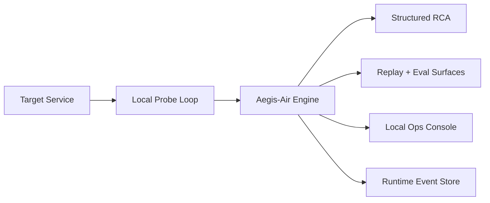

# Aegis-Air Solution Architecture

## Goal

Aegis-Air provides local-first incident review for teams that cannot send telemetry to public APIs.

## Design principles

- keep production-adjacent telemetry local
- separate deterministic structured RCA from optional narrative generation
- make replay evidence explicit before claiming live-loop readiness
- preserve an honest recorded-review mode when the live engine is absent

## System boundary

### Runtime components
- **Target service under probe** — the service Aegis-Air samples during live review
- **Local incident-review engine** — classifies incidents, builds structured RCA, and serves reviewer routes
- **Replay and eval layer** — deterministic incident cases used as proof and regression gates
- **Local frontend console** — reviewer-facing console with recorded-review fallback

### Supporting components
- **Runtime store** — lightweight JSONL persistence for local runtime events
- **Infra drafts** — deployment sketches for restricted-environment discussions

## Deployment topology

## Reviewer-facing surfaces

| Surface | Purpose |
|---|---|
| `/health` | readiness + route discovery |
| `/api/runtime/brief` | trust boundary, replay posture, target reachability |
| `/api/runtime/scorecard` | runtime telemetry + replay posture |
| `/api/replay-drift-board` | keeps weaker replay areas visible |
| `/api/incident-command-board` | commander-facing prioritization |
| `/api/review-pack` | reviewer-first proof bundle and handoff contract |
| `/api/schema/report` | downstream structured contract |

## Reliability posture

- replay suite provides a deterministic quality floor
- structured RCA remains available even when narrative streaming is degraded or absent
- live review and replay review share the same failure taxonomy and handoff vocabulary
- replay proof and live target reachability are surfaced as separate signals on purpose

## Why this matters for target roles

### AI engineer
- deterministic classification and RCA generation
- replay-driven regression proof
- local-first model boundary with fallback behavior

### Solutions architect
- explicit trust boundary for air-gapped or restricted deployments
- clean separation between target, engine, replay, and review UI
- realistic path from proof-of-value to hardened deployment

## Production hardening next steps

- signed audit snapshots for incident reviews
- richer role-aware operator access controls
- stronger private-network deployment modules
- longer-lived persistence and retention controls for restricted environments
