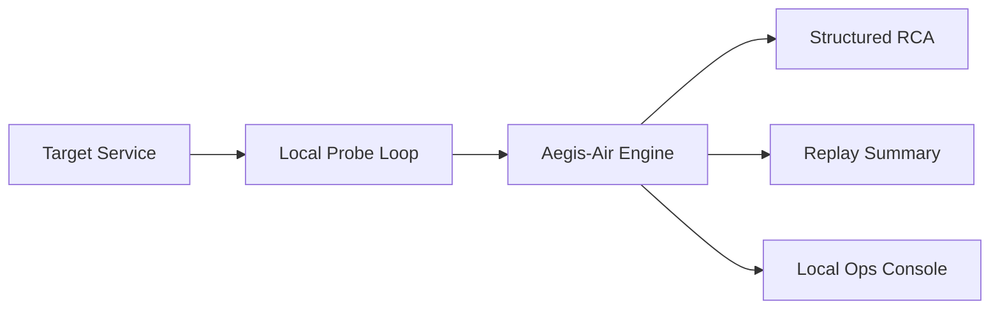

# Aegis-Air Solution Architecture

## Goal

Aegis-Air provides local-first incident review for teams that cannot send telemetry to public APIs.

## System boundary

- target service under probe
- local incident review engine
- replay and eval layer
- local frontend console
- optional Terraform deployment drafts for restricted environments

## Deployment topology

## Reliability posture

- replay suite provides a deterministic quality floor
- structured RCA contract remains available even when narrative mode is degraded
- live review path and replay path share the same incident vocabulary

## What makes this useful for an AI engineer

- local incident classification path
- replay-driven quality checks
- explicit failure-bucket taxonomy
- live probe plus deterministic replay in one service

## What makes this useful for a solutions architect

- restricted-environment deployment story
- clean trust boundary for air-gapped or local-first teams
- separation between target service, engine, and review UI

## Production hardening next steps

- add signed audit snapshots for incident reviews
- add role-aware access for local operator profiles
- add deployment modules for stricter private networking topologies
